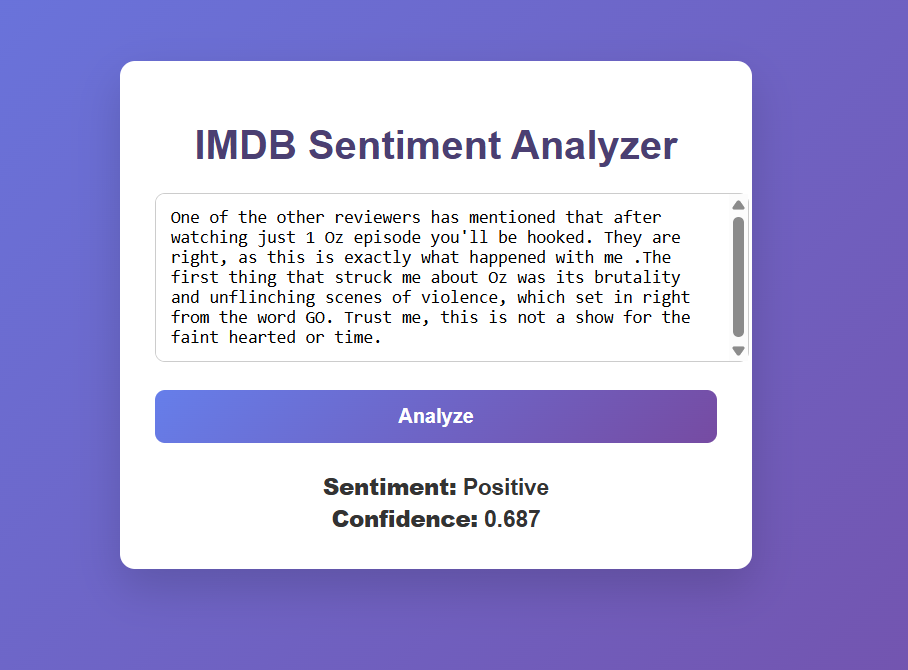
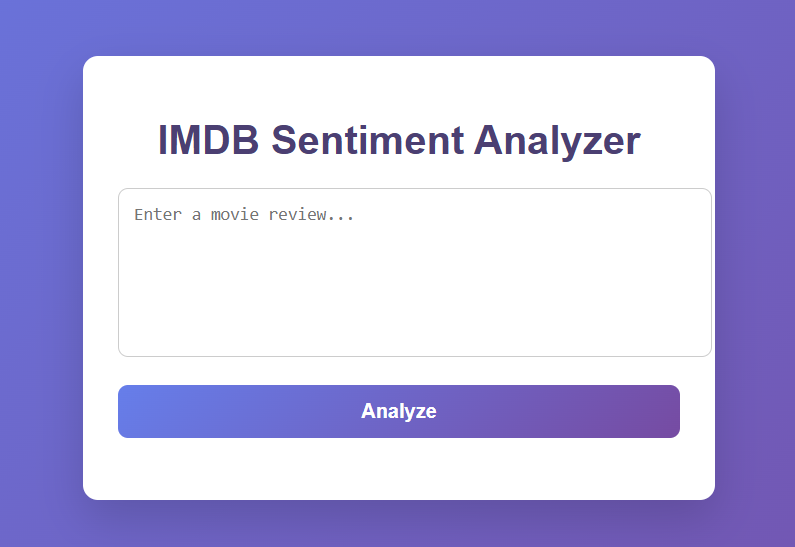

IMDb Sentiment Analysis Web Application

This project is a complete end-to-end NLP sentiment analysis system that classifies IMDb movie reviews as Positive, Negative, or Neutral / Uncertain.It combines classical NLP + Machine Learning, a Flask REST API, and a simple frontend built with HTML, CSS, and JavaScript.The application is designed with production-style practices, including model persistence, input validation, confidence-based predictions, and a clean project structure.


**Project Overview**

**The system performs sentiment analysis using the following workflow:**

1.User enters a movie review in the web interface

2.Text is sent to a Flask API

3.Text is preprocessed using the same logic as training

4.TF-IDF converts text into numerical features

5.A trained Logistic Regression model predicts sentiment

5.The result and confidence score are returned to the user


***Project Structure***
```
IMDB sentiment analysis/
│
├── app.py # Flask application (API + routing)
│
├── dataset/
│ ├── imdb.csv # Raw IMDb dataset
│ └── imdb_cleaned.csv # Cleaned & preprocessed dataset
│
├── model/
│ ├── logistic_regression_model.pkl # Trained Logistic Regression model
│ └── tfidf_vectorizer.pkl # TF-IDF vectorizer
│
├── templates/
│ └── index.html # Frontend HTML
│
├── static/
│ ├── style.css # CSS styling
│ └── script.js # Frontend JavaScript
│
├── train_model.py # Model training & tuning script
├── requirements.txt # Python dependencies
└── README.md # Project documentation```

**Dataset**

Dataset: IMDb Movie Reviews

Task: Binary sentiment classification

Labels:

    * positive

    * negative

Total samples: ~25,000

Class distribution: Balanced (50% positive, 50% negative)

***Preprocessing Steps***

1.Removal of HTML tags

2.Removal of non-alphabetic characters (A–Z, a–z only)

3.Lowercasing

4.Whitespace normalization

5.Stopword removal

6.Snowball stemming

7.TF-IDF vectorization

The fully processed dataset is saved as imdb_cleaned.csv to ensure reproducibility.


**Machine Learning Pipeline**

***Feature Extraction***

    TF-IDF Vectorizer

    max_features = 5000

    ngram_range = (1, 2) (unigrams + bigrams)

    Removes rare noisy terms

***Models Evaluated***

    Logistic Regression

    Linear SVM

    Naive Bayes

    Bagging with Logistic Regression

***Final Model Selection***

After comparison and tuning, Logistic Regression was selected due to:

    Highest accuracy and F1-score

    Stable generalization

    Simpler and more interpretable deployment

***Final hyperparameters:***

    C = 1

    penalty = l2

    solver = liblinear

**Input Validation & Confidence Handling**

    To avoid unreliable predictions, the API includes:

    Rejection of empty input

    Rejection of very short text (less than 3 words)

    If confidence < 0.6 → returns Neutral / Uncertain

    This ensures the model does not make misleading predictions on weak inputs.

### Prediction Result


**Installation & Setup**
1.  Clone the repository
    git clone <repository-url>
    cd IMDB-sentiment-analysis

2.  Create a virtual environment (optional but recommended)
    python -m venv venv 
    venv\Scripts\activate

3.  Install dependencies
    pip install -r requirements.txt

4.  Run the Flask application
    python app.py

### Home Page



***Open in browser:***

http://127.0.0.1:5000

**Requirements**

**Main dependencies:**

flask
scikit-learn
pandas
numpy


The requirements are intentionally kept minimal for faster setup and deployment.

**Key Features**

    End-to-end NLP pipeline

    Classical ML with explainable behavior

    Hyperparameter tuning with GridSearchCV

    Confidence-aware predictions

    Clean Flask API architecture

    Frontend–backend integration

    Reproducible preprocessing and inference

**Future Improvements**

    Cloud deployment (Render / Railway / AWS)

    Batch sentiment analysis

    Improved UI/UX

    Authentication and user history

    Transformer-based models (BERT, RoBERTa)

    Model monitoring and logging


## Author

- **Name:** Omkar Mahanandia  
- **Degree:** Master of Computer Applications (MCA)  
- **Interests:** Machine Learning, NLP, Full-Stack Development


